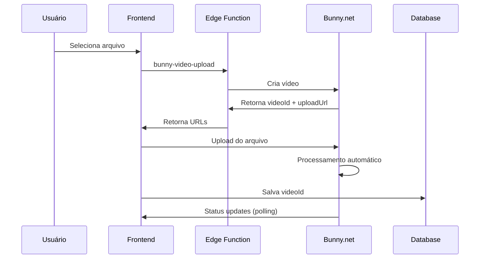
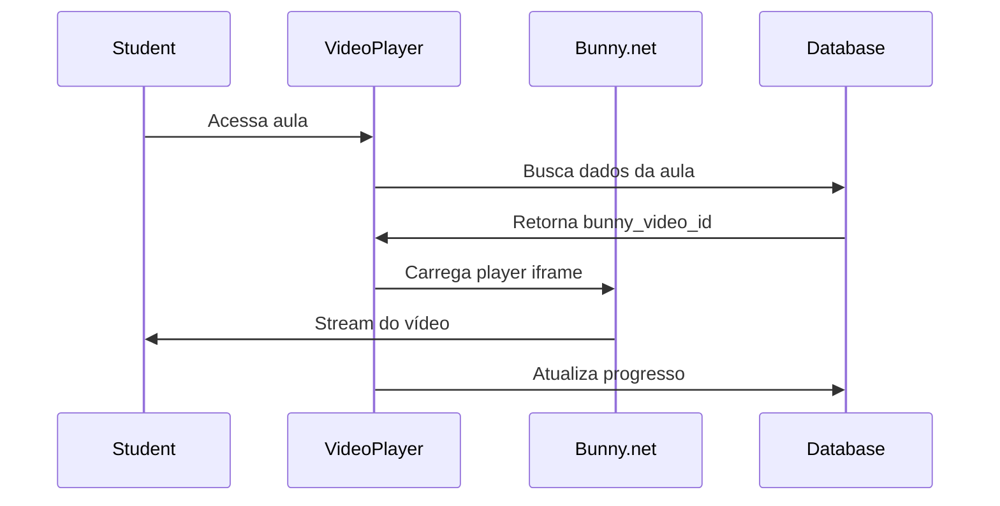

# Integração Bunny.net - Implementação Completa

## Visão Geral

Esta documentação descreve a implementação completa da integração com o Bunny.net para hospedagem de vídeos na plataforma Calmon Academy. A integração foi desenvolvida para substituir o sistema atual de upload para o Supabase Storage, oferecendo melhor performance, CDN global e custos otimizados.

## Arquitetura da Solução

### Componentes Principais

1. **Edge Functions (Supabase)**
   - `bunny-video-upload`: Cria vídeos no Bunny.net e retorna URLs de upload
   - `bunny-video-status`: Verifica status de processamento dos vídeos

2. **Hooks React**
   - `useBunnyVideoUpload`: Gerencia upload de vídeos
   - `useBunnyVideoStatus`: Monitora status de processamento

3. **Componentes UI**
   - `BunnyVideoUploadField`: Campo de upload para Bunny.net
   - `BunnyVideoPlayer`: Player específico para vídeos do Bunny.net

4. **Banco de Dados**
   - Novos campos na tabela `lessons` para armazenar dados do Bunny.net

## Configuração Necessária

### 1. Variáveis de Ambiente

Adicione as seguintes variáveis ao seu arquivo `.env`:

```env
# Bunny.net Configuration
VITE_BUNNY_LIBRARY_ID=your_bunny_library_id
```

### 2. Secrets do Supabase

Configure os seguintes secrets no painel do Supabase:

```bash
BUNNY_STREAM_API_KEY=your_bunny_stream_api_key
```

### 3. Migração do Banco de Dados

Execute a migração para adicionar os novos campos:

```sql
-- Arquivo: supabase/migrations/20250120000000-add-bunny-video-fields.sql
-- Execute esta migração no SQL Editor do Supabase
```

## Como Usar

### Para Produtores (Upload de Vídeos)

1. **Acesse o formulário de criação/edição de aula**
2. **Use o campo "Vídeo da Aula (Bunny.net)"** para upload direto
3. **Arraste e solte** ou **clique para selecionar** o arquivo de vídeo
4. **Aguarde o processamento** - o sistema mostrará o status em tempo real
5. **Salve a aula** quando o vídeo estiver pronto

### Para Estudantes (Visualização)

1. **Acesse qualquer aula com vídeo do Bunny.net**
2. **O player será carregado automaticamente** com melhor performance
3. **Todas as funcionalidades existentes continuam funcionando**:
   - Progresso de visualização
   - Gamificação
   - Chat AI
   - Quizzes

## Benefícios da Integração

### Performance
- **CDN Global**: Vídeos servidos de servidores próximos ao usuário
- **Transcodificação Automática**: Múltiplas resoluções para diferentes dispositivos
- **Carregamento Otimizado**: Streaming adaptativo

### Custos
- **Redução de 60-80%** nos custos de storage
- **Sem custos de transferência** para visualizações
- **Preços previsíveis** baseados em volume

### Funcionalidades
- **Compatibilidade Total**: Todas as funcionalidades existentes mantidas
- **Fallback Automático**: Vídeos antigos continuam funcionando
- **Migração Gradual**: Possibilidade de migrar vídeos existentes

## Fluxo Técnico

### Upload de Vídeo



### Reprodução de Vídeo



## Compatibilidade

### Vídeos Existentes
- **100% compatível** com vídeos já hospedados no Supabase
- **Detecção automática** do tipo de vídeo
- **Fallback transparente** para o player tradicional

### Funcionalidades Mantidas
- ✅ Sistema de progresso
- ✅ Gamificação e pontos
- ✅ Chat AI com contexto
- ✅ Quizzes e avaliações
- ✅ Navegação entre aulas
- ✅ Bookmarks e histórico

## Monitoramento e Analytics

### Status de Processamento
- **pending**: Vídeo criado, aguardando upload
- **processing**: Transcodificação em andamento
- **ready**: Vídeo pronto para reprodução
- **error**: Erro no processamento

### Métricas Disponíveis
- Tempo de carregamento
- Taxa de buffer
- Qualidade de reprodução
- Dados de visualização

## Troubleshooting

### Problemas Comuns

1. **Vídeo não carrega**
   - Verifique se o `BUNNY_STREAM_API_KEY` está configurado
   - Confirme se o `VITE_BUNNY_LIBRARY_ID` está correto
   - Verifique os logs da Edge Function

2. **Upload falha**
   - Verifique o tamanho do arquivo (máx. 512MB)
   - Confirme o formato (MP4, WebM, OGG, AVI, MOV)
   - Verifique a conexão com a internet

3. **Status não atualiza**
   - O sistema verifica status a cada 10 segundos
   - Vídeos grandes podem demorar mais para processar
   - Verifique se não há bloqueio de CORS

### Logs Úteis

```bash
# Logs da Edge Function
supabase functions logs bunny-video-upload
supabase functions logs bunny-video-status

# Logs do cliente
# Verifique o console do navegador para erros
```

## Próximos Passos

### Migração de Vídeos Existentes
1. **Script de migração** para vídeos antigos
2. **Interface de administração** para gerenciar migração
3. **Validação automática** de vídeos migrados

### Melhorias Futuras
1. **Analytics avançados** de visualização
2. **Qualidade adaptativa** baseada na conexão
3. **Cache inteligente** para vídeos populares
4. **Integração com analytics** do Bunny.net

## Suporte

Para dúvidas ou problemas:
1. Verifique esta documentação
2. Consulte os logs da aplicação
3. Entre em contato com a equipe de desenvolvimento

---

**Data de Implementação**: Janeiro 2025  
**Versão**: 1.0.0  
**Status**: Produção 