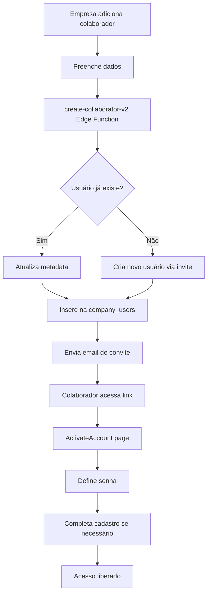
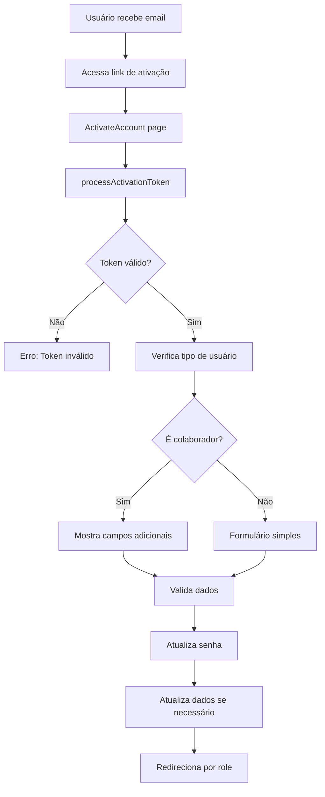

# 📚 DOCUMENTAÇÃO COMPLETA DO SISTEMA DE AUTENTICAÇÃO
## IA Generativa 360º - Plataforma de Educação Corporativa

---

## 📋 ÍNDICE

1. [Visão Geral do Sistema](#visão-geral)
2. [Arquitetura de Autenticação](#arquitetura)
3. [Tipos de Usuários e Roles](#tipos-usuarios)
4. [Fluxos de Autenticação](#fluxos)
5. [Componentes do Sistema](#componentes)
6. [Hooks Customizados](#hooks-customizados)
7. [Configuração e Setup](#configuracao)
8. [Dependências Externas](#dependencias-externas)
9. [Edge Functions](#edge-functions)
10. [Tabelas do Banco de Dados](#tabelas)
11. [Segurança e Auditoria](#seguranca)
12. [Troubleshooting](#troubleshooting)
13. [Manutenção e Monitoramento](#manutencao)

---

## 🎯 VISÃO GERAL DO SISTEMA

### Descrição
O sistema de autenticação da IA Generativa 360º é uma solução robusta e escalável baseada em **Supabase Auth** com múltiplas camadas de segurança, auditoria completa e suporte a diferentes tipos de usuários (Produtores, Empresas, Colaboradores e Estudantes).

### Características Principais
- ✅ **Multi-tenant**: Suporte a diferentes tipos de usuários
- ✅ **Auditoria Completa**: Logs detalhados de todas as ações
- ✅ **Segurança Robusta**: Rate limiting, validações e criptografia
- ✅ **Integração Stripe**: Autenticação vinculada a pagamentos
- ✅ **Edge Functions**: Processamento serverless
- ✅ **Monitoramento**: Sistema de alertas e notificações

---

## 🏗️ ARQUITETURA DE AUTENTICAÇÃO

### Diagrama da Arquitetura
```
┌─────────────────┐    ┌─────────────────┐    ┌─────────────────┐
│   Frontend      │    │   Supabase      │    │   Edge          │
│   (React)       │◄──►│   Auth          │◄──►│   Functions     │
└─────────────────┘    └─────────────────┘    └─────────────────┘
         │                       │                       │
         │                       │                       │
         ▼                       ▼                       ▼
┌─────────────────┐    ┌─────────────────┐    ┌─────────────────┐
│   AuthProvider  │    │   Database      │    │   Stripe        │
│   (Context)     │    │   (PostgreSQL)  │    │   Integration   │
└─────────────────┘    └─────────────────┘    └─────────────────┘
```

### Camadas do Sistema

#### 1. **Camada de Apresentação (Frontend)**
- **Localização**: `src/hooks/auth/`
- **Componentes**: AuthProvider, AuthForm, PasswordChangeDialog
- **Responsabilidades**: Interface do usuário, validações client-side

#### 2. **Camada de Serviços (Business Logic)**
- **Localização**: `src/hooks/auth/services/`
- **Serviços**: SignInService, SignUpService, PasswordService
- **Responsabilidades**: Lógica de negócio, validações, auditoria

#### 3. **Camada de Infraestrutura (Supabase)**
- **Localização**: `src/integrations/supabase/`
- **Componentes**: Client, tipos, configurações
- **Responsabilidades**: Comunicação com Supabase, autenticação base

#### 4. **Camada de Processamento (Edge Functions)**
- **Localização**: `supabase/functions/`
- **Funções**: create-collaborator-v2, create-company-auth-user
- **Responsabilidades**: Processamento serverless, integrações externas

---

## 👥 TIPOS DE USUÁRIOS E ROLES

### Hierarquia de Roles
```typescript
enum UserRole {
  PRODUCER = 'producer',        // Criador de conteúdo (nível mais alto)
  COMPANY = 'company',          // Empresa (administrador da conta)
  COLLABORATOR = 'collaborator', // Funcionário da empresa  
  STUDENT = 'student'           // Usuário padrão (menor privilégio)
}
```

### Detalhamento dos Roles

#### 🔥 **PRODUCER** (Produtor)
- **Descrição**: Criadores de conteúdo, administradores da plataforma
- **Permissões**: 
  - Criar e gerenciar cursos
  - Acessar dashboard de produtor
  - Gerenciar mentorias
  - Visualizar analytics completos
- **Tabela**: `producers`
- **Validação**: Função `is_current_user_producer_enhanced()`

#### 🏢 **COMPANY** (Empresa)
- **Descrição**: Administradores de empresas que compraram planos
- **Permissões**:
  - Gerenciar colaboradores
  - Acessar dashboard da empresa
  - Visualizar relatórios de uso
  - Configurar AI
- **Tabela**: `companies`
- **Integração**: Stripe para pagamentos

#### 👨‍💼 **COLLABORATOR** (Colaborador)
- **Descrição**: Funcionários das empresas
- **Permissões**:
  - Acessar cursos da empresa
  - Participar de mentorias
  - Visualizar progresso pessoal
- **Tabela**: `company_users`
- **Criação**: Via Edge Function `create-collaborator-v2`

#### 👨‍🎓 **STUDENT** (Estudante)
- **Descrição**: Usuários padrão da plataforma
- **Permissões**:
  - Acessar cursos gratuitos
  - Participar da comunidade
  - Sistema de gamificação
- **Tabela**: `profiles` (role padrão)

---

## 🔄 FLUXOS DE AUTENTICAÇÃO

### 1. **Fluxo de Login Padrão**

```mermaid
graph TD
    A[Usuário acessa /auth] --> B[Preenche email/senha]
    B --> C[AuthForm valida dados]
    C --> D[SignInService.processSignIn]
    D --> E{Supabase Auth}
    E --> F[Verifica role do usuário]
    F --> G[Redireciona para dashboard]
    
    F --> H{É Producer?}
    H -->|Sim| I[Verifica is_current_user_producer_enhanced]
    H -->|Não| J[Verifica outros roles]
    
    I -->|Válido| K[/producer/dashboard]
    I -->|Inválido| L[Erro: Acesso negado]
    J --> M[Redireciona por role]
```

### 2. **Fluxo de Registro de Empresa**

```mermaid
graph TD
    A[Cliente acessa /plans] --> B[Seleciona plano]
    B --> C[Preenche dados da empresa]
    C --> D[create-stripe-checkout Edge Function]
    D --> E[Redirect para Stripe]
    E --> F{Pagamento aprovado?}
    F -->|Não| G[Volta para /plans]
    F -->|Sim| H[/payment-success]
    H --> I[verify-payment Edge Function]
    I --> J[Cria usuário auth]
    J --> K[Cria registro empresa]
    K --> L[Envia email ativação]
    L --> M[Empresa faz primeiro login]
    M --> N{Credenciais válidas?}
    N -->|Não| O[create-company-auth-user]
    N -->|Sim| P[Verifica necessidade troca senha]
    P -->|Precisa| Q[PasswordChangeDialog]
    P -->|Não precisa| R[Acesso liberado]
```

### 3. **Fluxo de Criação de Colaborador**



### 4. **Fluxo de Ativação de Conta**

> ⚠️ **ATENÇÃO: CONFIGURAÇÃO CRÍTICA** ⚠️
> 
> Este fluxo requer configurações específicas para funcionar corretamente. Consulte o documento 
> [FLUXO-ATIVACAO-CONTA-IMPORTANTE.md](./FLUXO-ATIVACAO-CONTA-IMPORTANTE.md) para detalhes completos
> sobre problemas conhecidos, soluções implementadas e regras de manutenção.



**🔧 Nota sobre a Validação de Token**: O processo de validação (`processActivationToken`) é muito mais robusto do que o diagrama simplifica. Ele implementa uma estratégia de fallback com **4 métodos diferentes** para validar um token e estabelecer uma sessão:

1. **Método 1**: `verifyOtp` para tokens diretos de convite
2. **Método 2**: `getSessionFromUrl` para links de recuperação do Supabase v2.x
3. **Método 3**: `getSession` como fallback após processamento da URL
4. **Método 4**: Processamento manual do hash da URL como último recurso

Essa abordagem aumenta significativamente a resiliência do fluxo de ativação, garantindo compatibilidade com diferentes formatos de token e versões do Supabase.

**⚠️ Configuração Crítica do Cliente Supabase**: Para que este fluxo funcione corretamente, o cliente Supabase **DEVE** ser configurado com `detectSessionInUrl: false`. Caso contrário, o Supabase redirecionará automaticamente o usuário para a página principal antes que ele possa definir sua senha na página de ativação.

---

## 🧩 COMPONENTES DO SISTEMA

### 1. **AuthProvider** (`src/hooks/auth/AuthProvider.tsx`)

```typescript
interface AuthContextType {
  // Estado básico
  user: User | null;
  session: Session | null;
  loading: boolean;
  isInitialized: boolean;
  
  // Informações de role
  userRole: string;
  isProducer: boolean;
  isCompany: boolean;
  isStudent: boolean;
  isCollaborator: boolean;
  
  // Flags especiais
  needsPasswordChange: boolean;
  companyUserData: any;
  
  // Métodos
  signIn: (email: string, password: string, role?: string) => Promise<any>;
  signOut: () => Promise<void>;
  resetPassword: (email: string) => Promise<any>;
  changePassword: (newPassword: string) => Promise<any>;
  refreshUserRole: () => Promise<void>;
}
```

**Responsabilidades**:
- Gerenciar estado global de autenticação
- Fornecer métodos de autenticação
- Monitorar mudanças de sessão
- Controlar redirecionamentos

### 2. **Serviços de Autenticação**

#### SignInService (`src/hooks/auth/signInService.ts`)
```typescript
export const createSignInService = (toast: any) => {
  const signIn = async (email: string, password: string, role?: string) => {
    // 1. Validação de throttling
    // 2. Tentativa de login
    // 3. Verificação de role
    // 4. Auditoria
    // 5. Redirecionamento
  };
};
```

#### SignUpService (`src/hooks/auth/signUpService.ts`)
```typescript
export const createSignUpService = (toast: any) => {
  const signUp = async (email: string, password: string, role?: string) => {
    // 1. Validação de dados
    // 2. Criação de usuário
    // 3. Envio de email de confirmação
    // 4. Auditoria
  };
};
```

#### PasswordService (`src/hooks/auth/passwordService.ts`)
```typescript
export const createPasswordService = (toast: any) => {
  const resetPassword = async (email: string) => { /* ... */ };
  const changePassword = async (newPassword: string) => { /* ... */ };
};
```

### 3. **Componentes de Interface**

#### AuthForm (`src/hooks/auth/useAuthForm.ts`)
- Formulário de login/registro
- Validações client-side
- Tratamento de erros
- Estados de loading

#### PasswordChangeDialog (`src/components/PasswordChangeDialog.tsx`)
- Modal para troca de senha
- Validação de força da senha
- Integração com PasswordService

#### useIbgeLocation (Integração Externa)
- Hook para buscar dados de localização (estados e cidades) da API do IBGE
- Utilizado no formulário de ativação para preenchimento de dados de endereço do colaborador
- Representa uma dependência externa do sistema de autenticação
- URLs da API: 
  - Estados: `https://servicodados.ibge.gov.br/api/v1/localidades/estados`
  - Cidades: `https://servicodados.ibge.gov.br/api/v1/localidades/estados/{UF}/municipios`

#### ActivateAccount (`src/pages/ActivateAccount.tsx`)
- Página de ativação de conta, cuja lógica é encapsulada nos hooks `useActivationToken` e `useActivationForm`
- Processamento de tokens com estratégia de fallback robusta
- Formulário de dados adicionais para colaboradores
- Redirecionamento inteligente baseado no role do usuário
- Integração com API do IBGE para dados de localização

## 🪝 HOOKS CUSTOMIZADOS

### 4. **Hooks Customizados de Autenticação**

#### useActivationToken
Hook responsável pelo processamento robusto de tokens de ativação:

```typescript
// Estratégia de fallback com 4 métodos
const processActivationToken = async (token?: string, hash?: string) => {
  // Método 1: verifyOtp para tokens diretos
  // Método 2: getSessionFromUrl para Supabase v2.x
  // Método 3: getSession como fallback
  // Método 4: Processamento manual do hash
};
```

#### useActivationForm
Hook para gerenciar o formulário de ativação e dados adicionais:

```typescript
// Gerenciamento de estado do formulário
const [formData, setFormData] = useState({
  password: '',
  birthDate: '',
  gender: '',
  state: '',
  city: '',
  country: 'Brasil'
});

// Validações específicas para colaboradores
const validateCollaboratorData = () => {
  // Validação de idade (16-100 anos)
  const birthDateObj = new Date(birthDate);
  const today = new Date();
  const age = today.getFullYear() - birthDateObj.getFullYear();
  if (age < 16 || age > 100) {
    throw new Error('Idade deve estar entre 16 e 100 anos');
  }
  
  // Validação de campos obrigatórios
  if (!birthDate || !gender || !state || !city) {
    throw new Error('Todos os campos são obrigatórios');
  }
  
  // Validação de formato de dados
  if (!['masculino', 'feminino', 'outro'].includes(gender)) {
    throw new Error('Gênero deve ser masculino, feminino ou outro');
  }
};
```

#### Validações de Dados de Colaboradores
O sistema implementa validações rigorosas para dados de colaboradores:

**Campos Obrigatórios**:
- Data de nascimento (idade entre 16-100 anos)
- Gênero (masculino, feminino, outro)
- Estado e cidade (via API do IBGE)
- País (padrão: Brasil)

**Validações Específicas**:
- Conformidade com LGPD para dados pessoais
- Validação de idade mínima para trabalho
- Verificação de dados de localização via IBGE

---

## ⚙️ CONFIGURAÇÃO E SETUP

### 1. **Variáveis de Ambiente**

```bash
# Supabase
VITE_SUPABASE_URL=your_supabase_url
VITE_SUPABASE_ANON_KEY=your_supabase_anon_key  # Usado como SUPABASE_PUBLISHABLE_KEY no código

# Stripe
VITE_STRIPE_PUBLISHABLE_KEY=your_stripe_key
STRIPE_SECRET_KEY=your_stripe_secret

# URLs
VITE_FRONTEND_URL=https://your-domain.com
SUPABASE_ACTIVATION_REDIRECT_URL=https://your-domain.com/activate-account

# Email
RESEND_API_KEY=your_resend_key

# APIs Externas
# IBGE API (para dados de localização)
IBGE_API_BASE_URL=https://servicodados.ibge.gov.br/api/v1

### 2. **Configuração do Supabase**

#### Client (`src/integrations/supabase/client.ts`)
```typescript
import { createClient } from '@supabase/supabase-js';
import type { ExtendedDatabase } from './auth-tables-types';

const SUPABASE_URL = import.meta.env.VITE_SUPABASE_URL;
const SUPABASE_PUBLISHABLE_KEY = import.meta.env.VITE_SUPABASE_ANON_KEY;

if (!SUPABASE_URL || !SUPABASE_PUBLISHABLE_KEY) {
  throw new Error('Supabase URL e/ou chave anônima não definidas nas variáveis de ambiente.');
}

export const supabase = createClient<ExtendedDatabase>(SUPABASE_URL, SUPABASE_PUBLISHABLE_KEY, {
  auth: {
    storage: typeof window !== 'undefined' ? window.localStorage : undefined,
    persistSession: true,
    autoRefreshToken: true,
    detectSessionInUrl: false, // IMPORTANTE: Deve ser false para evitar redirecionamento automático na página de ativação
    // Removed flowType: 'pkce' to use default implicit flow which is more stable
  },
  global: {
    headers: {
      'X-Client-Info': 'lovable-auth-client'
    }
  }
});
```

> ⚠️ **ATENÇÃO: Configuração Crítica** ⚠️
> 
> A configuração `detectSessionInUrl: false` é **ESSENCIAL** para o funcionamento correto do fluxo de ativação de conta.
> Se definido como `true`, o Supabase tentará processar automaticamente tokens na URL e redirecionar o usuário,
> o que interfere com o processo de ativação de conta, impedindo que o formulário de definição de senha seja exibido.
>
> **NÃO ALTERE** esta configuração sem testar completamente o fluxo de ativação de conta!

#### Tipos (`src/integrations/supabase/types.ts`)
```typescript
export interface Database {
  public: {
    Tables: {
      profiles: {
        Row: { id: string; role: string; email: string; name: string };
        Insert: { id: string; role?: string; email?: string; name?: string };
        Update: { id?: string; role?: string; email?: string; name?: string };
      };
      // ... outras tabelas
    };
  };
}
```

## 🔗 DEPENDÊNCIAS EXTERNAS

### 3. **Dependências Externas**

#### API do IBGE
O sistema utiliza a API pública do IBGE para buscar dados de localização:

```typescript
// Exemplo de uso da API do IBGE
const fetchEstados = async () => {
  const response = await fetch('https://servicodados.ibge.gov.br/api/v1/localidades/estados?orderBy=nome');
  const estados = await response.json();
  return estados.map((uf: any) => ({ sigla: uf.sigla, nome: uf.nome }));
};

const fetchCidades = async (estadoSigla: string) => {
  const response = await fetch(`https://servicodados.ibge.gov.br/api/v1/localidades/estados/${estadoSigla}/municipios`);
  const cidades = await response.json();
  return cidades.map((c: any) => c.nome);
};
```

**Características**:
- API pública e gratuita
- Sem necessidade de autenticação
- Dados oficiais do governo brasileiro
- Utilizada apenas no formulário de ativação de colaboradores

#### Stripe API
Integração para processamento de pagamentos e assinaturas:

```typescript
// Configuração do Stripe
const stripeConfig = {
  publishableKey: process.env.VITE_STRIPE_PUBLISHABLE_KEY,
  secretKey: process.env.STRIPE_SECRET_KEY,
  webhookSecret: process.env.STRIPE_WEBHOOK_SECRET
};
```

### 4. **Configuração do Frontend**

#### AuthProvider Setup (`src/App.tsx`)
```typescript
import { AuthProvider } from '@/hooks/auth/AuthProvider';

function App() {
  return (
    <AuthProvider>
      <Router>
        <Routes>
          {/* Rotas protegidas */}
        </Routes>
      </Router>
    </AuthProvider>
  );
}
```

#### Proteção de Rotas (`src/components/AuthGuard.tsx`)
```typescript
export function AuthGuard({ children, requiredRole }: AuthGuardProps) {
  const { user, userRole, loading } = useAuth();
  
  if (loading) return <LoadingSpinner />;
  if (!user) return <Navigate to="/auth" />;
  if (requiredRole && userRole !== requiredRole) return <AccessDenied />;
  
  return <>{children}</>;
}
```

---

## 🚀 EDGE FUNCTIONS

> **Nota**: Esta seção documenta apenas as **11 Edge Functions** atualmente deployadas no ambiente de produção do Supabase.

### **Funções de Autenticação e Usuários**

#### 1. **create-collaborator-v2** (`supabase/functions/create-collaborator-v2/index.ts`)
- **URL**: `https://ldlxebhnkayiwksipvyc.supabase.co/functions/v1/create-collaborator-v2`
- **Deployments**: 9
- **Última atualização**: 1 hora atrás

**Propósito**: Criar novos colaboradores para empresas (versão melhorada)

**Fluxo**:
1. Recebe dados do colaborador
2. Verifica se usuário já existe
3. Cria ou atualiza usuário auth
4. Insere na tabela `company_users`
5. Envia email de convite

**Uso**:
```typescript
const response = await fetch('/functions/v1/create-collaborator-v2', {
  method: 'POST',
  headers: { 'Content-Type': 'application/json' },
  body: JSON.stringify({
    email: 'colaborador@empresa.com',
    name: 'Nome do Colaborador',
    company_id: 'uuid-da-empresa'
  })
});
```

#### 2. **create-company-auth-user** (`supabase/functions/create-company-auth-user/index.ts`)
- **URL**: `https://ldlxebhnkayiwksipvyc.supabase.co/functions/v1/create-company-auth-user`
- **Deployments**: 23
- **Última atualização**: 7 dias atrás

**Propósito**: Criar usuário auth para empresas existentes

**Fluxo**:
1. Recebe dados da empresa
2. Verifica se usuário auth existe
3. Cria usuário via `inviteUserByEmail`
4. Atualiza tabela `companies`
5. Envia email de ativação

#### 3. **update-collaborator-email** (`supabase/functions/update-collaborator-email/index.ts`)
- **URL**: `https://ldlxebhnkayiwksipvyc.supabase.co/functions/v1/update-collaborator-email`
- **Deployments**: 4
- **Última atualização**: 7 dias atrás

**Propósito**: Atualizar email de colaboradores

**Funcionalidades**:
- Validação de permissões
- Atualização no auth e company_users
- Notificação por email

#### 4. **login-with-rate-limit** (`supabase/functions/login-with-rate-limit/index.ts`)
- **URL**: `https://ldlxebhnkayiwksipvyc.supabase.co/functions/v1/login-with-rate-limit`
- **Deployments**: 3
- **Última atualização**: 5 dias atrás

**Propósito**: Implementar rate limiting no login

**Funcionalidades**:
- Controle de tentativas de login
- Bloqueio temporário após falhas
- Auditoria de tentativas

### **Funções de Pagamento e Stripe**

#### 5. **stripe-webhook** (`supabase/functions/stripe-webhook/index.ts`)
- **URL**: `https://ldlxebhnkayiwksipvyc.supabase.co/functions/v1/stripe-webhook`
- **Deployments**: 40
- **Última atualização**: 1 dia atrás

**Propósito**: Processar eventos do Stripe

**Eventos Processados**:
- `customer.subscription.created`
- `customer.subscription.updated`
- `customer.subscription.deleted`
- `invoice.payment_succeeded`
- `invoice.payment_failed`

#### 6. **create-stripe-checkout** (`supabase/functions/create-stripe-checkout/index.ts`)
- **URL**: `https://ldlxebhnkayiwksipvyc.supabase.co/functions/v1/create-stripe-checkout`
- **Deployments**: 32
- **Última atualização**: 1 dia atrás

**Propósito**: Criar sessão de checkout do Stripe

**Fluxo**:
1. Recebe dados do plano
2. Cria sessão de checkout
3. Retorna URL de pagamento

#### 7. **check-subscription** (`supabase/functions/check-subscription/index.ts`)
- **URL**: `https://ldlxebhnkayiwksipvyc.supabase.co/functions/v1/check-subscription`
- **Deployments**: 9
- **Última atualização**: 2 dias atrás

**Propósito**: Verificar status de assinatura

**Funcionalidades**:
- Sincronização com Stripe
- Atualização de status no banco
- Retorno de dados da assinatura

#### 8. **get-stripe-prices** (`supabase/functions/get-stripe-prices/index.ts`)
- **URL**: `https://ldlxebhnkayiwksipvyc.supabase.co/functions/v1/get-stripe-prices`
- **Deployments**: 4
- **Última atualização**: 4 dias atrás

**Propósito**: Buscar preços dos planos no Stripe

**Retorno**:
- Lista de preços ativos
- Dados dos planos
- Informações de cobrança

#### 9. **get-stripe-analytics** (`supabase/functions/get-stripe-analytics/index.ts`)
- **URL**: `https://ldlxebhnkayiwksipvyc.supabase.co/functions/v1/get-stripe-analytics`
- **Deployments**: 3
- **Última atualização**: 2 dias atrás

**Propósito**: Gerar relatórios de analytics do Stripe

**Dados Retornados**:
- Receita total
- Número de assinaturas
- Métricas por empresa
- Relatórios de crescimento

### **Funções de IA e Conteúdo**

#### 10. **ai-chat** (`supabase/functions/ai-chat/index.ts`)
- **URL**: `https://ldlxebhnkayiwksipvyc.supabase.co/functions/v1/ai-chat`
- **Deployments**: 19
- **Última atualização**: 7 dias atrás

**Propósito**: Processar chat com IA

**Funcionalidades**:
- Integração com modelos de IA
- Contexto de conversa
- Histórico de mensagens
- Respostas personalizadas

#### 11. **generate-quiz** (`supabase/functions/generate-quiz/index.ts`)
- **URL**: `https://ldlxebhnkayiwksipvyc.supabase.co/functions/v1/generate-quiz`
- **Deployments**: 4
- **Última atualização**: 7 dias atrás

**Propósito**: Gerar quizzes automaticamente

**Recursos**:
- Geração baseada em conteúdo
- Múltiplos tipos de questão
- Dificuldade ajustável
- Validação automática

---

### **Configuração e Deploy das Edge Functions**

#### Variáveis de Ambiente Necessárias
```bash
# Supabase
SUPABASE_URL=your_supabase_url
SUPABASE_SERVICE_ROLE_KEY=your_service_role_key

# Stripe
STRIPE_SECRET_KEY=your_stripe_secret
STRIPE_WEBHOOK_SECRET=your_webhook_secret

# Email (Resend)
RESEND_API_KEY=your_resend_key

# URLs
FRONTEND_URL=https://your-domain.com
```

#### Comandos de Deploy
```bash
# Deploy de todas as funções
supabase functions deploy

# Deploy de função específica
supabase functions deploy create-collaborator-v2

# Verificar status
supabase functions list

# Ver logs
supabase functions logs create-collaborator-v2 --follow
```

#### Monitoramento e Logs
```typescript
// Exemplo de monitoramento de função
const monitorFunction = async (functionName: string) => {
  const { data, error } = await supabase.functions.invoke(functionName, {
    body: { test: true }
  });
  
  if (error) {
    console.error(`❌ ${functionName} failed:`, error);
    // Enviar alerta
  } else {
    console.log(`✅ ${functionName} succeeded:`, data);
  }
};
```

---

## 🗄️ TABELAS DO BANCO DE DADOS

### Tabelas de Autenticação (Schema `auth`)

#### `auth.users`
```sql
-- Tabela principal de usuários do Supabase
-- Campos principais:
- id: uuid (PK)
- email: varchar
- encrypted_password: varchar
- email_confirmed_at: timestamptz
- user_metadata: jsonb
- raw_user_meta_data: jsonb
```

#### `auth.sessions`
```sql
-- Sessões ativas dos usuários
-- Campos principais:
- id: uuid (PK)
- user_id: uuid (FK -> auth.users)
- created_at: timestamptz
- expires_at: timestamptz
```

### Tabelas de Aplicação (Schema `public`)

#### `profiles`
```sql
CREATE TABLE profiles (
  id UUID REFERENCES auth.users(id) PRIMARY KEY,
  role VARCHAR DEFAULT 'student' CHECK (role IN ('student', 'producer', 'company', 'collaborator')),
  email TEXT,
  name TEXT,
  created_at TIMESTAMPTZ DEFAULT NOW(),
  updated_at TIMESTAMPTZ DEFAULT NOW()
);
```

#### `companies`
```sql
CREATE TABLE companies (
  id UUID PRIMARY KEY DEFAULT gen_random_uuid(),
  auth_user_id UUID REFERENCES auth.users(id) UNIQUE,
  name VARCHAR NOT NULL,
  email VARCHAR,
  subscription_status TEXT DEFAULT 'inactive',
  stripe_customer_id TEXT,
  stripe_subscription_id TEXT UNIQUE,
  -- ... outros campos
);
```

#### `company_users`
```sql
CREATE TABLE company_users (
  id UUID PRIMARY KEY DEFAULT gen_random_uuid(),
  auth_user_id UUID REFERENCES auth.users(id) NOT NULL,
  company_id UUID REFERENCES companies(id) NOT NULL,
  name VARCHAR NOT NULL,
  email VARCHAR NOT NULL,
  is_active BOOLEAN DEFAULT true,
  needs_complete_registration BOOLEAN DEFAULT false,
  birth_date DATE,
  gender TEXT,
  cidade TEXT,
  estado TEXT,
  pais TEXT,
  updated_at TIMESTAMPTZ DEFAULT NOW()
);
```

#### `producers`
```sql
CREATE TABLE producers (
  id UUID PRIMARY KEY DEFAULT gen_random_uuid(),
  auth_user_id UUID REFERENCES auth.users(id) UNIQUE,
  name VARCHAR NOT NULL,
  email VARCHAR NOT NULL,
  is_active BOOLEAN DEFAULT true
);
```

### Tabelas de Auditoria

#### `auth_audit_logs`
```sql
CREATE TABLE auth_audit_logs (
  id UUID PRIMARY KEY DEFAULT gen_random_uuid(),
  event_type TEXT NOT NULL CHECK (event_type IN ('login_success', 'login_failure', 'logout', 'password_reset', 'password_change', 'signup')),
  user_id UUID REFERENCES auth.users(id),
  email TEXT,
  ip_address TEXT,
  user_agent TEXT,
  metadata JSONB DEFAULT '{}',
  created_at TIMESTAMPTZ DEFAULT NOW()
);
```

#### `auth_login_attempts`
```sql
CREATE TABLE auth_login_attempts (
  id UUID PRIMARY KEY DEFAULT gen_random_uuid(),
  email TEXT UNIQUE NOT NULL,
  attempt_count INTEGER DEFAULT 0,
  last_attempt TIMESTAMPTZ DEFAULT NOW(),
  locked_until TIMESTAMPTZ,
  created_at TIMESTAMPTZ DEFAULT NOW(),
  updated_at TIMESTAMPTZ DEFAULT NOW()
);
```

---

## 🔒 SEGURANÇA E AUDITORIA

### 1. **Rate Limiting**

#### ThrottlingService (`src/hooks/auth/throttlingService.ts`)
```typescript
export const createThrottlingService = () => {
  const MAX_ATTEMPTS = 5;
  const LOCKOUT_DURATION_MINUTES = 15;
  
  const checkLoginAttempts = async (email: string) => {
    // Verifica tentativas de login
    // Bloqueia após 5 tentativas falhadas
    // Libera após 15 minutos
  };
};
```

### 2. **Validação de Senhas**

#### Password Validation (`src/hooks/auth/commonAuthUtils.ts`)
```typescript
export const validatePassword = (password: string) => {
  const minLength = 8;
  const hasUpperCase = /[A-Z]/.test(password);
  const hasLowerCase = /[a-z]/.test(password);
  const hasNumbers = /\d/.test(password);
  const hasSpecialChar = /[!@#$%^&*(),.?":{}|<>]/.test(password);
  
  // Retorna validação completa
};
```

### 3. **Auditoria Completa**

#### AuditService (`src/hooks/auth/auditService.ts`)
```typescript
export const createAuditService = () => {
  const logAuthEvent = async (
    eventType: string,
    userId: string | null,
    email: string,
    metadata: any
  ) => {
    // Registra evento na tabela auth_audit_logs
    // Inclui IP, User-Agent, timestamp
  };
};
```

### 4. **Validação de Roles**

#### Producer Validation
```sql
-- Função para validar se o usuário atual é um produtor
CREATE OR REPLACE FUNCTION is_current_user_producer_enhanced()
RETURNS BOOLEAN AS $$
DECLARE
  current_user_id UUID;
  producer_exists BOOLEAN;
BEGIN
  -- Obtém o ID do usuário atual
  current_user_id := auth.uid();
  
  -- Verifica se o usuário existe na tabela de produtores
  SELECT EXISTS(
    SELECT 1 FROM producers 
    WHERE auth_user_id = current_user_id 
    AND is_active = true
  ) INTO producer_exists;
  
  RETURN producer_exists;
END;
$$ LANGUAGE plpgsql SECURITY DEFINER;

-- RLS Policy para produtores
CREATE POLICY "Producers can access their own data" ON producers
  FOR ALL USING (auth_user_id = auth.uid());
```

#### Company Validation
```sql
-- Função para validar se o usuário atual é uma empresa
CREATE OR REPLACE FUNCTION is_current_user_company()
RETURNS BOOLEAN AS $$
DECLARE
  current_user_id UUID;
  company_exists BOOLEAN;
BEGIN
  current_user_id := auth.uid();
  
  SELECT EXISTS(
    SELECT 1 FROM companies 
    WHERE auth_user_id = current_user_id 
    AND subscription_status = 'active'
  ) INTO company_exists;
  
  RETURN company_exists;
END;
$$ LANGUAGE plpgsql SECURITY DEFINER;
```

#### Collaborator Validation
```sql
-- Função para validar se o usuário atual é um colaborador
CREATE OR REPLACE FUNCTION is_current_user_collaborator()
RETURNS BOOLEAN AS $$
DECLARE
  current_user_id UUID;
  collaborator_exists BOOLEAN;
BEGIN
  current_user_id := auth.uid();
  
  SELECT EXISTS(
    SELECT 1 FROM company_users 
    WHERE auth_user_id = current_user_id 
    AND is_active = true
  ) INTO collaborator_exists;
  
  RETURN collaborator_exists;
END;
$$ LANGUAGE plpgsql SECURITY DEFINER;
```

### 5. **Criptografia e Tokens**

#### JWT Configuration
```typescript
// Configuração de JWT no Supabase
const jwtConfig = {
  expiresIn: '24h',
  algorithm: 'HS256',
  issuer: 'ia-generativa-360',
  audience: 'ia-generativa-360-users'
};
```

#### Token Refresh
```typescript
// Auto-refresh de tokens
supabase.auth.onAuthStateChange((event, session) => {
  if (event === 'TOKEN_REFRESHED') {
    // Token foi renovado automaticamente
    console.log('Token refreshed successfully');
  }
});
```

---

## 🔧 TROUBLESHOOTING

### 1. **Problemas Comuns de Autenticação**

#### Erro: "Invalid login credentials"
**Causas Possíveis**:
- Email ou senha incorretos
- Conta bloqueada por tentativas excessivas
- Conta não ativada

**Soluções**:
```typescript
// Verificar se a conta está ativada
const { data: user } = await supabase.auth.getUser();
if (!user.user?.email_confirmed_at) {
  // Reenviar email de ativação
  await supabase.auth.resend({
    type: 'signup',
    email: user.user.email
  });
}

// Verificar tentativas de login
const { data: attempts } = await supabase
  .from('auth_login_attempts')
  .select('*')
  .eq('email', email)
  .single();
```

#### Erro: "Access denied" para Produtores
**Causas Possíveis**:
- Usuário não existe na tabela `producers`
- Campo `is_active` está `false`
- Problema na função `is_current_user_producer_enhanced()`

**Soluções**:
```sql
-- Verificar se o usuário existe na tabela producers
SELECT * FROM producers WHERE auth_user_id = 'user-uuid';

-- Verificar se a função está funcionando
SELECT is_current_user_producer_enhanced();

-- Recriar o usuário produtor se necessário
INSERT INTO producers (auth_user_id, name, email, is_active)
VALUES ('user-uuid', 'Nome do Produtor', 'email@exemplo.com', true);
```

#### Erro: "Company subscription inactive"
**Causas Possíveis**:
- Assinatura Stripe cancelada
- Pagamento pendente
- Problema na sincronização com Stripe

**Soluções**:
```typescript
// Verificar status da assinatura
const { data: company } = await supabase
  .from('companies')
  .select('subscription_status, stripe_subscription_id')
  .eq('auth_user_id', user.id)
  .single();

// Sincronizar com Stripe
if (company.stripe_subscription_id) {
  const response = await fetch('/functions/v1/check-subscription', {
    method: 'POST',
    headers: { 'Content-Type': 'application/json' },
    body: JSON.stringify({ subscription_id: company.stripe_subscription_id })
  });
}
```

### 2. **Problemas de Edge Functions**

#### Erro: "Function not found"
**Causas Possíveis**:
- Edge Function não foi deployada
- URL incorreta
- Problema de CORS

**Soluções**:
```bash
# Deployar Edge Function
supabase functions deploy create-collaborator-v2

# Verificar status das funções
supabase functions list

# Verificar logs
supabase functions logs create-collaborator-v2
```

#### Erro: "CORS policy"
**Soluções**:
```typescript
// Configurar CORS na Edge Function
const corsHeaders = {
  'Access-Control-Allow-Origin': '*',
  'Access-Control-Allow-Headers': 'authorization, x-client-info, apikey, content-type',
};

// Adicionar headers na resposta
return new Response(JSON.stringify(data), {
  headers: { ...corsHeaders, 'Content-Type': 'application/json' }
});
```

### 3. **Problemas de Email**

#### Emails não estão sendo enviados
**Causas Possíveis**:
- Configuração incorreta do Resend
- Rate limiting
- Email marcado como spam

**Soluções**:
```typescript
// Verificar configuração do Resend
const resend = new Resend(process.env.RESEND_API_KEY);

// Testar envio de email
try {
  const { data, error } = await resend.emails.send({
    from: 'noreply@ia-generativa-360.com',
    to: 'test@exemplo.com',
    subject: 'Test Email',
    html: '<p>Test email</p>'
  });
  
  if (error) {
    console.error('Email error:', error);
  }
} catch (error) {
  console.error('Resend error:', error);
}
```

### 4. **Problemas de Performance**

#### Login lento
**Causas Possíveis**:
- Muitas consultas ao banco
- Falta de índices
- Problemas de rede

**Soluções**:
```sql
-- Adicionar índices para melhorar performance
CREATE INDEX idx_profiles_email ON profiles(email);
CREATE INDEX idx_companies_auth_user_id ON companies(auth_user_id);
CREATE INDEX idx_company_users_auth_user_id ON company_users(auth_user_id);
CREATE INDEX idx_producers_auth_user_id ON producers(auth_user_id);

-- Índice para auditoria
CREATE INDEX idx_auth_audit_logs_user_id ON auth_audit_logs(user_id);
CREATE INDEX idx_auth_audit_logs_created_at ON auth_audit_logs(created_at);
```

#### Problemas de Memória
**Soluções**:
```typescript
// Implementar cache para dados frequentemente acessados
const userRoleCache = new Map();

const getUserRole = async (userId: string) => {
  if (userRoleCache.has(userId)) {
    return userRoleCache.get(userId);
  }
  
  const { data } = await supabase
    .from('profiles')
    .select('role')
    .eq('id', userId)
    .single();
  
  userRoleCache.set(userId, data?.role);
  return data?.role;
};
```

---

## 🛠️ MANUTENÇÃO E MONITORAMENTO

### 1. **Monitoramento de Logs**

#### Logs de Autenticação
```sql
-- Consulta para monitorar tentativas de login
SELECT 
  event_type,
  COUNT(*) as count,
  DATE_TRUNC('hour', created_at) as hour
FROM auth_audit_logs 
WHERE created_at >= NOW() - INTERVAL '24 hours'
GROUP BY event_type, hour
ORDER BY hour DESC;

-- Consulta para identificar IPs suspeitos
SELECT 
  ip_address,
  COUNT(*) as attempts,
  COUNT(CASE WHEN event_type = 'login_failure' THEN 1 END) as failures
FROM auth_audit_logs 
WHERE created_at >= NOW() - INTERVAL '1 hour'
GROUP BY ip_address
HAVING COUNT(*) > 10 OR COUNT(CASE WHEN event_type = 'login_failure' THEN 1 END) > 5;
```

#### Logs de Edge Functions
```bash
# Monitorar logs em tempo real
supabase functions logs --follow

# Filtrar logs por função
supabase functions logs create-collaborator-v2 --follow

# Exportar logs para análise
supabase functions logs create-collaborator-v2 > logs.txt
```

### 2. **Alertas e Notificações**

#### Configuração de Alertas
```typescript
// Sistema de alertas para problemas de autenticação
const alertService = {
  async checkFailedLogins() {
    const { data } = await supabase
      .from('auth_audit_logs')
      .select('*')
      .eq('event_type', 'login_failure')
      .gte('created_at', new Date(Date.now() - 15 * 60 * 1000).toISOString());
    
    if (data && data.length > 10) {
      await this.sendAlert('Muitas tentativas de login falhadas detectadas');
    }
  },
  
  async sendAlert(message: string) {
    // Enviar alerta via email, Slack, etc.
    console.log('ALERT:', message);
  }
};
```

#### Monitoramento de Assinaturas
```typescript
// Verificar assinaturas expiradas
const checkExpiredSubscriptions = async () => {
  const { data: companies } = await supabase
    .from('companies')
    .select('*')
    .eq('subscription_status', 'active')
    .lt('subscription_end_date', new Date().toISOString());
  
  for (const company of companies || []) {
    await alertService.sendAlert(
      `Assinatura da empresa ${company.name} expirou`
    );
  }
};
```

### 3. **Backup e Recuperação**

#### Backup Automático
```sql
-- Script para backup das tabelas de autenticação
-- Executar diariamente via cron

-- Backup das tabelas principais
pg_dump -h your-host -U your-user -d your-db \
  -t profiles -t companies -t company_users -t producers \
  -t auth_audit_logs -t auth_login_attempts \
  > backup_auth_$(date +%Y%m%d).sql

-- Backup das Edge Functions
supabase functions list > functions_backup_$(date +%Y%m%d).txt
```

#### Plano de Recuperação
```bash
#!/bin/bash
# Script de recuperação em caso de falha

echo "Iniciando recuperação do sistema de autenticação..."

# 1. Restaurar backup do banco
psql -h your-host -U your-user -d your-db < backup_auth_latest.sql

# 2. Redeploy das Edge Functions
supabase functions deploy create-collaborator-v2
supabase functions deploy create-company-auth-user
supabase functions deploy validate-access
supabase functions deploy stripe-webhook

# 3. Verificar integridade
echo "Verificando integridade dos dados..."
psql -h your-host -U your-user -d your-db -c "
  SELECT COUNT(*) as total_users FROM profiles;
  SELECT COUNT(*) as total_companies FROM companies;
  SELECT COUNT(*) as total_collaborators FROM company_users;
"

echo "Recuperação concluída!"
```

### 4. **Manutenção Preventiva**

#### Limpeza de Logs Antigos
```sql
-- Limpar logs de auditoria antigos (manter apenas 90 dias)
DELETE FROM auth_audit_logs 
WHERE created_at < NOW() - INTERVAL '90 days';

-- Limpar tentativas de login antigas
DELETE FROM auth_login_attempts 
WHERE last_attempt < NOW() - INTERVAL '30 days';

-- Limpar sessões expiradas
DELETE FROM auth.sessions 
WHERE expires_at < NOW();
```

#### Otimização de Performance
```sql
-- Análise de performance das tabelas
ANALYZE profiles;
ANALYZE companies;
ANALYZE company_users;
ANALYZE producers;
ANALYZE auth_audit_logs;

-- Vacuum para liberar espaço
VACUUM ANALYZE auth_audit_logs;
VACUUM ANALYZE auth_login_attempts;
```

#### Atualização de Estatísticas
```sql
-- Atualizar estatísticas do banco
SELECT schemaname, tablename, attname, n_distinct, correlation
FROM pg_stats 
WHERE schemaname IN ('public', 'auth')
ORDER BY schemaname, tablename;
```

### 5. **Testes Automatizados**

#### Testes de Autenticação
```typescript
// Testes automatizados para o sistema de autenticação
describe('Authentication System', () => {
  test('should allow valid producer login', async () => {
    const result = await signInService.signIn(
      'producer@test.com',
      'validPassword123'
    );
    expect(result.success).toBe(true);
    expect(result.userRole).toBe('producer');
  });
  
  test('should block invalid credentials', async () => {
    const result = await signInService.signIn(
      'invalid@test.com',
      'wrongPassword'
    );
    expect(result.success).toBe(false);
  });
  
  test('should create collaborator successfully', async () => {
    const response = await fetch('/functions/v1/create-collaborator-v2', {
      method: 'POST',
      headers: { 'Content-Type': 'application/json' },
      body: JSON.stringify({
        email: 'collaborator@test.com',
        name: 'Test Collaborator',
        company_id: 'test-company-id'
      })
    });
    
    expect(response.status).toBe(200);
  });
});
```

#### Testes de Integração
```typescript
// Testes de integração com Stripe
describe('Stripe Integration', () => {
  test('should process webhook events correctly', async () => {
    const mockEvent = {
      type: 'customer.subscription.created',
      data: { /* mock data */ }
    };
    
    const response = await fetch('/functions/v1/stripe-webhook', {
      method: 'POST',
      headers: { 'Content-Type': 'application/json' },
      body: JSON.stringify(mockEvent)
    });
    
    expect(response.status).toBe(200);
  });
});
```

---

## 📊 MÉTRICAS E ANALYTICS

### 1. **Métricas de Autenticação**

#### Dashboard de Métricas
```sql
-- Métricas diárias de autenticação
SELECT 
  DATE(created_at) as date,
  event_type,
  COUNT(*) as count
FROM auth_audit_logs 
WHERE created_at >= NOW() - INTERVAL '30 days'
GROUP BY DATE(created_at), event_type
ORDER BY date DESC, event_type;

-- Taxa de sucesso de login
SELECT 
  DATE(created_at) as date,
  COUNT(CASE WHEN event_type = 'login_success' THEN 1 END) as successes,
  COUNT(CASE WHEN event_type = 'login_failure' THEN 1 END) as failures,
  ROUND(
    COUNT(CASE WHEN event_type = 'login_success' THEN 1 END) * 100.0 / 
    COUNT(*), 2
  ) as success_rate
FROM auth_audit_logs 
WHERE event_type IN ('login_success', 'login_failure')
  AND created_at >= NOW() - INTERVAL '7 days'
GROUP BY DATE(created_at)
ORDER BY date DESC;
```

#### Métricas por Tipo de Usuário
```sql
-- Distribuição de usuários por role
SELECT 
  role,
  COUNT(*) as user_count,
  ROUND(COUNT(*) * 100.0 / SUM(COUNT(*)) OVER (), 2) as percentage
FROM profiles 
GROUP BY role
ORDER BY user_count DESC;

-- Crescimento de usuários por mês
SELECT 
  DATE_TRUNC('month', created_at) as month,
  role,
  COUNT(*) as new_users
FROM profiles 
WHERE created_at >= NOW() - INTERVAL '12 months'
GROUP BY DATE_TRUNC('month', created_at), role
ORDER BY month DESC, role;
```

### 2. **Métricas de Performance**

#### Tempo de Resposta
```typescript
// Monitoramento de tempo de resposta das Edge Functions
const performanceMonitor = {
  async measureFunctionPerformance(functionName: string, fn: Function) {
    const start = Date.now();
    try {
      const result = await fn();
      const duration = Date.now() - start;
      
      // Log de performance
      console.log(`${functionName} executed in ${duration}ms`);
      
      // Alertar se demorou muito
      if (duration > 5000) {
        await alertService.sendAlert(
          `${functionName} está lento: ${duration}ms`
        );
      }
      
      return result;
    } catch (error) {
      const duration = Date.now() - start;
      console.error(`${functionName} failed after ${duration}ms:`, error);
      throw error;
    }
  }
};
```

#### Uso de Recursos
```sql
-- Monitoramento de uso de recursos do banco
SELECT 
  schemaname,
  tablename,
  n_tup_ins as inserts,
  n_tup_upd as updates,
  n_tup_del as deletes,
  n_live_tup as live_rows,
  n_dead_tup as dead_rows
FROM pg_stat_user_tables 
WHERE schemaname IN ('public', 'auth')
ORDER BY n_live_tup DESC;
```

---

## 🔮 ROADMAP E MELHORIAS FUTURAS

### 1. **Melhorias de Segurança**

#### Autenticação Multi-Fator (MFA)
```typescript
// Implementação futura de MFA
const mfaService = {
  async enableMFA(userId: string) {
    // Gerar secret para TOTP
    const secret = generateTOTPSecret();
    
    // Salvar secret no banco
    await supabase
      .from('user_mfa_settings')
      .upsert({
        user_id: userId,
        totp_secret: secret,
        is_enabled: true
      });
    
    return secret;
  },
  
  async verifyMFA(userId: string, token: string) {
    // Verificar token TOTP
    const { data } = await supabase
      .from('user_mfa_settings')
      .select('totp_secret')
      .eq('user_id', userId)
      .single();
    
    return verifyTOTPToken(data.totp_secret, token);
  }
};
```

#### Biometria
```typescript
// Suporte futuro para autenticação biométrica
const biometricAuth = {
  async registerBiometric(userId: string, biometricData: any) {
    // Registrar dados biométricos criptografados
    const encryptedData = await encryptBiometricData(biometricData);
    
    await supabase
      .from('user_biometric_data')
      .insert({
        user_id: userId,
        biometric_data: encryptedData,
        created_at: new Date().toISOString()
      });
  }
};
```

### 2. **Melhorias de UX**

#### Login Social
```typescript
// Integração com provedores sociais
const socialAuth = {
  async signInWithGoogle() {
    const { data, error } = await supabase.auth.signInWithOAuth({
      provider: 'google',
      options: {
        redirectTo: `${window.location.origin}/auth/callback`
      }
    });
    return { data, error };
  },
  
  async signInWithMicrosoft() {
    const { data, error } = await supabase.auth.signInWithOAuth({
      provider: 'azure',
      options: {
        redirectTo: `${window.location.origin}/auth/callback`
      }
    });
    return { data, error };
  }
};
```

#### Single Sign-On (SSO)
```typescript
// Implementação de SSO para empresas
const ssoService = {
  async configureSSO(companyId: string, ssoConfig: any) {
    // Configurar SAML/OIDC para a empresa
    await supabase
      .from('company_sso_config')
      .upsert({
        company_id: companyId,
        provider: ssoConfig.provider,
        config: ssoConfig
      });
  },
  
  async initiateSSO(companyId: string) {
    // Iniciar fluxo SSO
    const { data } = await supabase
      .from('company_sso_config')
      .select('config')
      .eq('company_id', companyId)
      .single();
    
    return generateSSOUrl(data.config);
  }
};
```

### 3. **Melhorias de Performance**

#### Cache Distribuído
```typescript
// Implementação de cache Redis
const cacheService = {
  async getUserRole(userId: string) {
    const cacheKey = `user_role:${userId}`;
    
    // Tentar buscar do cache
    const cached = await redis.get(cacheKey);
    if (cached) {
      return JSON.parse(cached);
    }
    
    // Buscar do banco
    const { data } = await supabase
      .from('profiles')
      .select('role')
      .eq('id', userId)
      .single();
    
    // Salvar no cache por 1 hora
    await redis.setex(cacheKey, 3600, JSON.stringify(data?.role));
    
    return data?.role;
  }
};
```

#### Otimização de Consultas
```sql
-- Índices compostos para melhorar performance
CREATE INDEX idx_profiles_role_created ON profiles(role, created_at);
CREATE INDEX idx_companies_status_created ON companies(subscription_status, created_at);
CREATE INDEX idx_company_users_company_active ON company_users(company_id, is_active);

-- Materialized views para relatórios complexos
CREATE MATERIALIZED VIEW auth_daily_stats AS
SELECT 
  DATE(created_at) as date,
  event_type,
  COUNT(*) as count
FROM auth_audit_logs 
GROUP BY DATE(created_at), event_type;

-- Refresh da view materializada
REFRESH MATERIALIZED VIEW auth_daily_stats;
```

---

## 📝 CONCLUSÃO

O sistema de autenticação da IA Generativa 360º é uma solução robusta e escalável que atende às necessidades de uma plataforma de educação corporativa moderna. Com múltiplas camadas de segurança, auditoria completa e suporte a diferentes tipos de usuários, o sistema oferece:

### ✅ **Pontos Fortes**
- **Arquitetura bem estruturada** com separação clara de responsabilidades
- **Segurança robusta** com rate limiting, validações e auditoria
- **Escalabilidade** através de Edge Functions e cache
- **Flexibilidade** para diferentes tipos de usuários
- **Monitoramento completo** com logs e métricas

### 🔄 **Áreas de Melhoria Contínua**
- Implementação de MFA para maior segurança
- Otimização de performance com cache distribuído
- Expansão para login social e SSO
- Melhorias na UX baseadas em feedback dos usuários

### 📊 **Métricas de Sucesso**
- Taxa de sucesso de login > 95%
- Tempo de resposta < 2 segundos
- Zero violações de segurança
- 99.9% de uptime

Este sistema serve como base sólida para o crescimento da plataforma, permitindo adicionar novos recursos e funcionalidades mantendo a segurança e performance em níveis elevados.

---

## 📞 SUPORTE E CONTATO

Para dúvidas, sugestões ou problemas relacionados ao sistema de autenticação:

- **Documentação**: Este arquivo e documentação técnica
- **Issues**: Repositório do projeto
- **Email**: suporte@ia-generativa-360.com
- **Slack**: Canal #autenticacao

---

*Documentação atualizada em: Janeiro 2025*
*Versão: 1.0*
*Autor: Equipe de Desenvolvimento IA Generativa 360º*